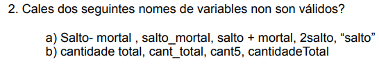

# Ejercicio 2 Boletin 1

a)
Salto- mortal : invalido por espacios
salto_mortal : valido
salto + mortal: invalido por signo +
2salto: invalido por empezar por numero
"salto" : invalido por comillas

b)
cantidad total: invalido por espacio
cant_total, cant5 y cantidadeTotal : validos

# Ejercicio 4 Boletin 1

a) true and true == false --> true and false --> False

b) not false == true --> true == true --> True

 
c) (true and true) or false == true --> true or (False == true) --> True or false --> True 

d) (false or false) and false != true --> false and (false != true) --> false and true --> False

e)(not(true and false)) == false --> (not false) == false --> True == false --> False 

f) "12" + "12" == "24" --> False --> "1212"
g) "34"+"43" == "3443" --> True --> "3443"

# Ejercicio 5 Boletin 1

a) 1 + 1 < = 0 - 3 and 1 >= 2 --> 2 <= -3 and 1 >= 2 --> False
b) 