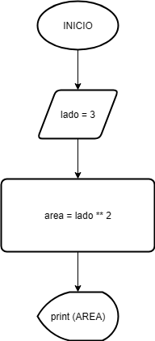
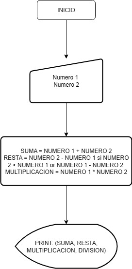
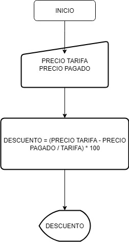
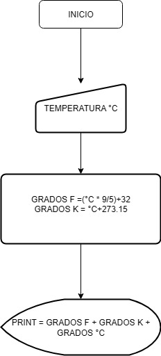

# ORGANIGRAMAS

## Ejercicio 2
### 2- Realiza un ordinograma que permita calcular o área dun cadrado de 3 m de lado. De seguido crea un proxecto en java, co nome boletin2_2, para executalo.

## Ejercicio 4
### - Deseña un ordinograma que lea 2 números e calcule a suma, despois a resta, a continuación o produto e por último o cociente. Amosa o resultado de cada operación. De seguido codifica o programa correspondente

## Ejercicio 6
### Realiza o ordinograma correspondente a un programa que saque por pantalla a porcentaxe descontada nunha compra. Introducindo, por teclado, o prezo da tarifa e o prezo pagado.

## Ejercicio 7
### Realiza o ordinograma e despois codifica un programa que reciba como dato de entrada o valor dunha temperatura expresada en graos centígrados e calcule o seu equivalente en graos Fahrenheit e graos Kelvin.
